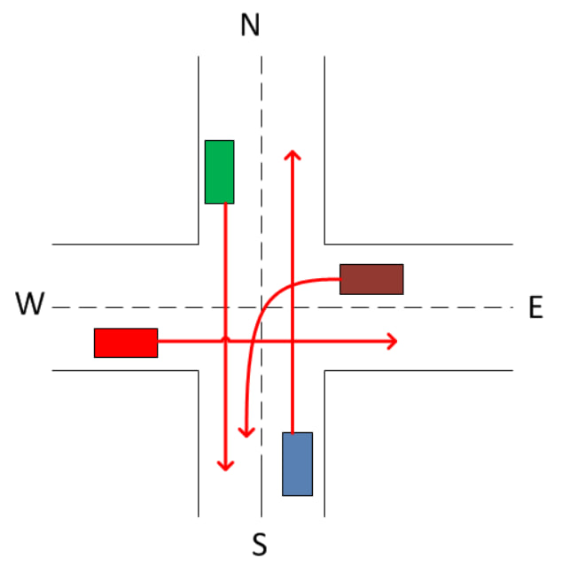

# Создание многопоточного приложения
## Задание
В данной работе необходимо написать многопоточное приложение, которое эмулирует заданную модель. Студент сам должен спроектировать потоки, которые отвечают за поведение сущностей из полученного задания. Взаимодействие потоков должно быть синхронизировано и приложение должно быть протестирование на наличие dead locks и race conditions. Приложение не должно переставать работать из-за изменения задержек и модель не должна быть полностью синхронной.

## Вариант
Перекресток. Автомобили движутся в заданных направлениях. Подъезжая к перекрестку, машины встают в очередь. На перекрестке стоит интелектуальный светофор и разрешает ехать одновременно тем машинам, траектории которых не имеют пересечения. У перекрестка четыре направления: N,W,S,E. Светофор может разрешить движение по любым непересекающимся комбинациям направлений, например, NS,SE.

